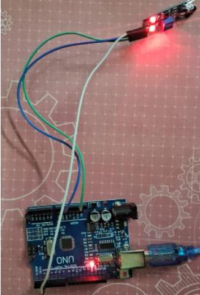

# IR-Based People Counter using Arduino

## 📌 Overview
This project is a simple IR-based people counting system using Arduino Uno. It detects people passing in a queue and increases the count. It also detects misalignment when movement is too fast.

## 🚀 Features
- Counts number of people
- Detects misalignment
- Uses built-in LED (Pin 13)
- Displays output in Serial Monitor

## 🧰 Components Used
- Arduino Uno
- IR Sensor Module
- Jumper Wires
- Breadboard
- USB Cable

## 🔌 Circuit Connections
- IR VCC → Arduino 5V  
- IR GND → Arduino GND  
- IR OUT → Arduino Pin 2  
- Built-in LED → Pin 13  

## 💻 Code
File: `queue_counter.ino`

## 📷 Project Images

### 🔹 Setup

### 🔹 Output

## ▶️ Working
- IR sensor detects when a person crosses
- Arduino increases count
- LED Inbuilt in arduino blinks for each count
- Misalignment is detected if movement is too fast

## 📊 Output
- Serial Monitor shows: Count: 1, Count: 2...
- LED blinks for each person

## 👩‍💻 Author
Nivedhitha K